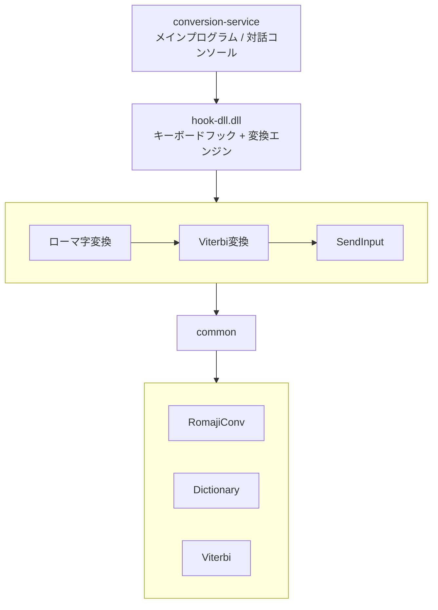

# IME Live Converter

Windows向けのmacOSライブ変換風IME（日本語入力システム）です。タブやスペースキーを押さずに、入力した文字がリアルタイムで漢字変換されます。

## 機能

- **ローマ字→ひらがな変換**: 入力したローマ字をリアルタイムでひらがなに変換
- **ひらがな→漢字変換（ライブ変換）**: ひらがなを入力中に自動で漢字に変換
- **Viterbi アルゴリズム**: 最適な変換パスを探索して自然な変換結果を生成
- **キーボードフック**: 低レベル WH_KEYBOARD_LL + SendInput で全アプリに対応
- **学習**: 確定した変換を SQLite（`ime-learning.db`）に記録し、使うほど賢くなる
- **もしかして（誤字補正）**: **自動変換に失敗した時だけ**、意味の通る候補を提案。2段構え:
  - **ローマ字取り残し**: 英字が残って変換できないケース（例: `gmennasai`→`ごめんなさい`、`saynara`→`さよなら`、`nippon`→`にっぽん`）。母音抜け・打ちすぎ・転置・末尾nをカバー。
  - **かなレベル補正**: ローマ字は全部かなになったが実在語に変換できていない（未知語のまま／カタカナ化）ケースを、辞書のあいまい検索（Trie上のLevenshtein）＋変換コストで「意味の通る語」に寄せる（例: `きづついて`→`傷ついて`、`がっこ`→`学校`、拗音の打ち間違い `きよう`→`きょう`）。
- **前方一致の予測補完**: 過去に確定した内容に前方一致する語を候補表示
- **候補一覧のページング**: 同音異義語は1ページ9件で固定表示。9件を超えると自動でページが切り替わり、位置（例 12/23）を表示。縦に伸びず、予測一覧も同じ描画で統一
- **単語登録**: 辞書に無い複合語（例「思い出の品」）を「読み→表記」で登録（日本語変換モードで `Ctrl+Alt+A`）。ライブ変換器の辞書へ即注入され、次の変換から候補に出る
- **誤学習のリセット**: 候補一覧・予測一覧で選択中の変換を **Delete** で1件だけ学習取消（過去に誤確定して上位に居座った変換を掃除）
- **カーソル移動**: 変換中でも ←→ で1文字カーソル移動、素早く2回で行端（Home/End）
- **環境ごとのモード**: ウィンドウ（ターミナル等）ごとに日本語入力/コマンドモードを独立して記憶
- **コマンドモード（ターミナル）**: ターミナル（Windows Terminal / PowerShell / cmd / Git Bash / **VSCode統合ターミナル**）ではよく使うコマンドを提案。Tabで選択、Enterで実行、**Deleteで履歴削除**
- **コマンド/エイリアス**: `gs`→`git status` のようなエイリアスを登録し、コマンドモードで素早く実行（設定ウィンドウで管理）
- **単一インスタンス**: 二重起動を防止（多重フックによる二重入力を回避）

## アーキテクチャ




## ビルド

```bash
cargo build --release
```

## 辞書の準備

本格的な漢字変換には辞書が必要です。IPA辞書（MeCab用）を使用できます。

### 1. IPA辞書のダウンロード

```bash
# 安定ミラー（Debian）からダウンロード
curl -L -o mecab-ipadic.tar.gz \
  "http://deb.debian.org/debian/pool/main/m/mecab-ipadic/mecab-ipadic_2.7.0-20070801+main.orig.tar.gz"

tar xzf mecab-ipadic.tar.gz
```

### 2. バイナリ辞書の生成

```bash
# dict-builder を使って辞書を生成（約39万語、-r/--release 推奨）
cargo run --release -p dict-builder --bin dict-builder -- \
  build ./mecab-ipadic-2.7.0-20070801 ./dictionaries/system.dic
```

`dictionaries/system.dic` があれば CLI 起動時に自動でロードされます
（なければ `dictionaries/sample.dic` にフォールバック）。

## 使い方

### CLI の起動

```bash
cargo run --release -p ime-cli
```

起動すると辞書と学習DB（`ime-learning.db`、自動作成）がロードされます。

### ライブ変換モード（おすすめ）

プロンプトで `:live` と打つとライブ変換モードに入ります。
ローマ字をそのまま打つと、入力停止（250ms）や句読点・「です/ます」などの
文節境界で自動的に仮変換されます。

| キー | 動作 |
|------|------|
| Space | 仮変換の実行 / 次候補 |
| Shift+Space | 前候補 |
| Enter | 確定（学習に記録） |
| Esc | 仮変換をキャンセルしてひらがなに戻す |
| Backspace | 1文字削除（Ctrl+Backspace で全消し） |
| Ctrl+C | ライブモード終了 |

### 全アプリ版（conversion-service）のキー操作

**日本語入力モード**（半角/全角キーで ON）:

| キー | 動作 |
|------|------|
| **Tab** / ↓ | 通常変換（同音候補一覧を開く・次候補）。候補が9件を超えると**自動でページが切り替わり**、全候補を巡回できます |
| ↑ / Shift+Tab | 前候補 |
| 数字 1〜9 | 一覧・予測から番号で直接選択・確定（**各ページの1〜9**。ページ送りで全候補を番号選択可） |
| **Delete** | 候補一覧・**予測一覧**で選択中の変換の**誤学習をリセット**（過去に誤確定して上位に居座った変換や、誤って学習された予測補完を、その1件だけ取り消す。同じ読みの他の学習は残る） |
| **Space** | 現在の変換を確定して空白を入れる（非変換中は通常の空白） |
| **← / →** | カーソルを1文字移動（変換中は確定してから移動）。**素早く2回で行端**（←=Home / →=End） |
| Backspace | 直近の変換単語（文節）ごと削除 |
| **Esc** | 末尾から一文節ずつひらがなに戻す（押すたびに前へ）。戻すものが無ければ取消 |
| Enter / 句読点 | 確定（学習に記録）。予測/もしかして表示中は選択中の候補を確定 |
| 半角/全角 | 日本語入力 ⇔ 英数（コマンドモード）を切替（**環境ごとに独立**） |
| Ctrl+Space | 変換機能の緊急ON/OFF |
| **Ctrl+Alt+A** | 設定を開く（**モードで出し分け**）。日本語変換モード → **単語登録**ウィンドウ／コマンドモード → **コマンド設定**ウィンドウ |

- **もしかして**は、ローマ字が取り残されて自動変換に失敗した時だけ「もしかして: ◯◯」と先頭に出ます。↑↓/番号で選び Enter で確定します（正しく変換できている入力には出ません）。
- **単語登録**（日本語変換モードで `Ctrl+Alt+A`）: 辞書に無い複合語（例「思い出の品」）を「読み → 表記」で登録できます。登録した語は `user_dictionary`（DB）に保存され、ライブ変換器の辞書へ即反映されます（次の変換から候補に出ます）。一覧から選んで削除も可能です。

### コマンドモード（ターミナル）

ターミナル（Windows Terminal / PowerShell / cmd / Git Bash / VSCode統合ターミナル）に
フォーカスがあり、日本語入力OFF（半角/全角で切替）のとき自動でコマンドモードになります。
打ったコマンドを学習し、次回から前方一致で候補を出します。

| キー | 動作 |
|------|------|
| （入力） | 打鍵に応じてコマンド候補ポップアップを表示（**先頭が選択状態**） |
| **Tab / Shift+Tab** | 候補一覧の選択（ハイライト）を上下に移動（挿入・実行はしない） |
| **Enter** | 選択中の候補を挿入＆実行（エイリアスは展開。`auto_run` オフのものは挿入のみで編集可） |
| **Delete** | 選択中が**コマンド履歴**なら、その履歴を学習DBから削除して一覧から消す（エイリアスは対象外。設定ウィンドウで管理） |
| ↑ / ↓ | シェルの履歴呼び出し（触りません） |
| Esc | 候補を閉じる |
| ⚙ 設定（ポップアップ右上） | 設定ウィンドウを開く |

- 別のターミナル/ウィンドウへ移って戻ると、**カーソルが戻った時点で**その環境の入力内容が
  復元され候補ポップアップが自動で再表示されます（打鍵を待ちません）。
- ポップアップの見出しに、選択中候補の Enter の挙動（**Enter:即実行** / **Enter:挿入のみ**）が
  表示されます（設定ウィンドウの「Enterで即実行」チェックと連動。Tab で候補を移動すると
  その候補の挙動に切り替わります）。

### コマンド/エイリアスの設定（設定ウィンドウ）

`Ctrl+Alt+A` またはコマンドポップアップ右上の **⚙ 設定** で開きます。

- **登録内容**: エイリアス名 / コマンド・スクリプト（「参照...」でスクリプトファイルを選択可）/ 説明 を入力して「新規/更新」。
  - エイリアス名を空にすると「コマンド」（履歴コマンドの説明編集用）として登録。
  - **「Enterで即実行」チェック**: オンならコマンドモードでの Enter で即実行、オフなら挿入のみ（`git commit -m ""` のように編集してから実行するコマンド用）。
- **一覧テーブル**: エイリアス / コマンド / 説明 / **Enter**（即実行 / ✎挿入のみ）の列。列見出しクリックで名前順ソート（▲▼表示）。行をクリックでフォームに反映（チェックボックスにも反映）、下部の詳細欄に全文表示。
  - 検索・並び替え・登録後も編集中の行の選択は維持され、チェックボックスの表示と一覧の Enter 列が常に同じ項目を指します（登録後に続けて別の項目を入力するときは「クリア」）。
- **検索** で絞り込み、**並び替え**ボタンで 作成順 ⇔ 使用頻度順、**表示**ドロップダウンで すべて/エイリアス/コマンド を切替。

## 常時バックグラウンドで起動する

キーボードフックはユーザーセッションで動く必要があるため、Windows サービス
ではなく **ログオン時に常駐**させます。`--background` を付けると標準入力を
読まずに常駐します（対話コマンドは使えません）。

### 自動起動を登録（推奨: 非表示・ログオン時）

```powershell
# 先にビルドしておく
cargo build --release

# 管理者権限の PowerShell で登録（次回ログオンから非表示で自動起動）
powershell -ExecutionPolicy Bypass -File scripts\install-autostart.ps1

# 今すぐ開始する場合
Start-ScheduledTask -TaskName IMELiveConverter
```

- 黒いコンソールは出ません（`scripts\run-hidden.vbs` 経由で非表示起動）。
- 最上位の権限で動くので、管理者権限のアプリ上でも変換が効きます。
- **停止/解除**: `powershell -ExecutionPolicy Bypass -File scripts\uninstall-autostart.ps1`
- 一時的に手動で試すだけなら: `wscript scripts\run-hidden.vbs`（停止はタスクマネージャーで `conversion-service.exe` を終了）

### 学習がおかしくなったら（誤変換の学習を掃除）

誤変換のまま確定を続けると、その誤りを学習して悪化することがあります
（再汚染を防ぐガードは入っていますが、過去の汚染は下記で掃除できます）。

**その場で1件だけ消す**: 変換中に **Tab** で候補一覧を開く（または予測一覧が
出ている状態で）、誤学習された変換を選んで **Delete** を押すと、その (読み→表記)
の学習だけをその場でリセットできます（DBの確定履歴・バイグラムとメモリ上の学習の
両方から消え、同じ読みの他の正しい学習は残ります）。「誤って確定した内容がそのまま
予測に出てくる」ケースもこれで消せます。日常的な誤学習はこれが一番手軽です。

**まとめて掃除する**（大きく汚染された場合）:

```powershell
python scripts\clean-learning-db.py            # 掃除
python scripts\clean-learning-db.py --dry-run  # 何が消えるか確認だけ
```

> **誤字補正について**: 以前は Shift+Space でローカルLLM校正を行っていましたが、
> CPU実行では速度・精度の費用対効果が低かったため**廃止**しました。代わりに、
> ローマ字が取り残されて自動変換に失敗した時だけ即時に働く「もしかして」補正
> （辞書＋ローマ字編集の探索。LLM不要）に置き換えています。

### 行単位モード（検証用）

プロンプトにそのまま入力すると変換候補一覧が表示されます。

| コマンド | 説明 |
|----------|------|
| `:live` | ライブ変換モード |
| `:commit <N>` | N番目の候補を確定して履歴学習 |
| `:user add <読み> <表記>` | ユーザー辞書に登録 |
| `:typo <入力>` | 誤字補正候補のみ表示 |
| `:nbest <入力> [N]` | Viterbi N-best のみ表示 |
| `:help` / `:quit` | ヘルプ / 終了 |

## 開発

### プロジェクト構造

```
crates/
├── common/           # 共通ライブラリ
│   ├── dictionary.rs # 辞書データ構造
│   ├── viterbi.rs    # Viterbi変換エンジン
│   └── lib.rs        # ローマ字変換
├── hook-dll/         # キーボードフックDLL
├── conversion-service/ # メインプログラム
└── dict-builder/     # 辞書ビルダー
```

### テスト

```bash
cargo test
```

## 制限事項

- ローマ字入力（US配列想定）が対象。JIS配列だと一部の記号がずれます。
- ターミナル等はIMEの未確定文字列を持てないため、ライブ変換は Backspace+文字挿入で
  再現しています（描画の遅い環境では稀に乱れることがあります）。
- コマンドモードの打鍵追跡は「観測」ベースのため、貼り付けやシェル補完で挿入された
  文字は追跡できません（矢印での行編集時は候補追跡をリセットします）。
- VSCode等の統合ターミナル判定は UI Automation（フォーカス要素のクラス名/名前）に
  依存するため、環境によっては検出できないことがあります。
- 一部のアプリケーションでは動作しない可能性があります。

## ライセンス

MIT License

## 参考

- [MeCab](https://taku910.github.io/mecab/) - 形態素解析エンジン
- [IPA辞書](https://taku910.github.io/mecab/#download) - 辞書データ
